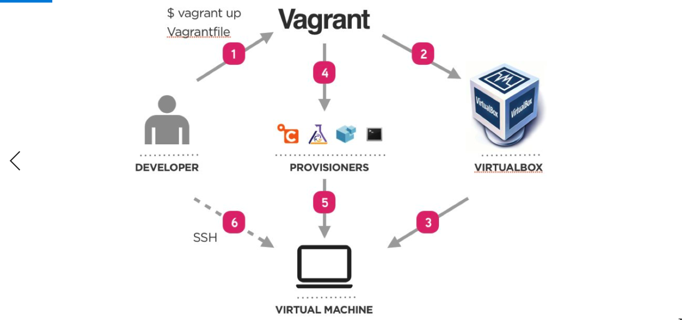

# Setting up Development Env
## installation of Vagrant, Virtual box and Ruby


### vagrant commands
- ` vagrant up` to launch the vm
- `vagrant destroy` to delete everything 
- `vagrant reload` to reload any new instruction in our `Vagrantfile`
- `vagrant halt` it poses the vm
- `vagrant status`

#### More commands can be found by typing `vagrant` on gitbash terminal and you'll see below outcome
```
Common commands:
     box             manages boxes: installation, removal, etc.
     cloud           manages everything related to Vagrant Cloud
     destroy         stops and deletes all traces of the vagrant machine
     global-status   outputs status Vagrant environments for this user
     halt            stops the vagrant machine
     help            shows the help for a subcommand
     hostsupdater
     init            initializes a new Vagrant environment by creating a Vagrantfile
     login
     package         packages a running vagrant environment into a box
     plugin          manages plugins: install, uninstall, update, etc.
     port            displays information about guest port mappings
     powershell      connects to machine via powershell remoting
     provision       provisions the vagrant machine
     push            deploys code in this environment to a configured destination
     rdp             connects to machine via RDP
     reload          restarts vagrant machine, loads new Vagrantfile configuration
     resume          resume a suspended vagrant machine
     snapshot        manages snapshots: saving, restoring, etc.
     ssh             connects to machine via SSH
     ssh-config      outputs OpenSSH valid configuration to connect to the machine
     status          outputs status of the vagrant machine
     suspend         suspends the machine
     up              starts and provisions the vagrant environment
     upload          upload to machine via communicator
     validate        validates the Vagrantfile
     version         prints current and latest Vagrant version
     winrm           executes commands on a machine via WinRM
     winrm-config    outputs WinRM configuration to connect to the machine

For help on any individual command run `vagrant COMMAND -h`
```
- Let's `ssh` into our vm and launch nginx web-server
- use `apt-get` package manager in Linux - for mac `homebrew` or only `brew`
- `apt-get` is used to install and uninstall any packages needed
- To use the command in `admin` mode we can use `sudo` before the command
- `sudo apt-get upgrade -y`
- `sudo apt-get update -y`
- `ping www.bbc.co.uk`
- `sudo apt-get install name_of_the_package` 
- To work in an `admin mode` at all times (not recommonded) `sudo -su` and you'll land in admin mode
- We will install nginx in our guest machine/VM/ubuntu 16.04
- launch the default nginx page in host machine's browser
- To come out of your VM `exit`
- install nginx `sudo apt-get install nginx -y`
- checking status of nginx ` systemctl status nginx` 
- or restrat ` systemctl restart nginx` or just to start ` systemctl start nginx` 


- step 1: Install the plugin `vagrant plugin install vagrant-hostsupdater`
- step 2: vagrant destroy
- step 3: add this line of code into Vagrantfile `config.hostsupdater.aliases = ["development.local"]`
- step 4: vagrant up
- step 5: vagrant ssh
- step 6: repeat all the update and upgrade commands followed by installing nginx and checking of nginx
- `ningx status active` should load nginx in the browswer with `192.168.10.100` as well as `http://development.local/`

- if the `http://development.local/` doesn't work then try following debugging steps
- open a new `Gitbash termial` as `admin`
- `vagrant destroy`
- `rm -rf .vagrant`
- `vagrant up`

- Just in case if still doesn't work then try:
- `vagrant plugin uninstall vagrant-hostsupdater`
- update plugin with `vagrant plugin update vagrant-hostsupdater`
- open a new `Gitbash termial` as `admin`
- `vagrant destroy`
- `rm -rf .vagrant`
- `vagrant up`

#### Restart your machine after installing or updating the plugin

- if your machine isn't accepting the plugin and you can see nginx default page on `192.168.10.100` its fine for now
- Push your progress by 14:00 and share your repos please.

https://github.com/agiledivider/vagrant-hostsupdater


